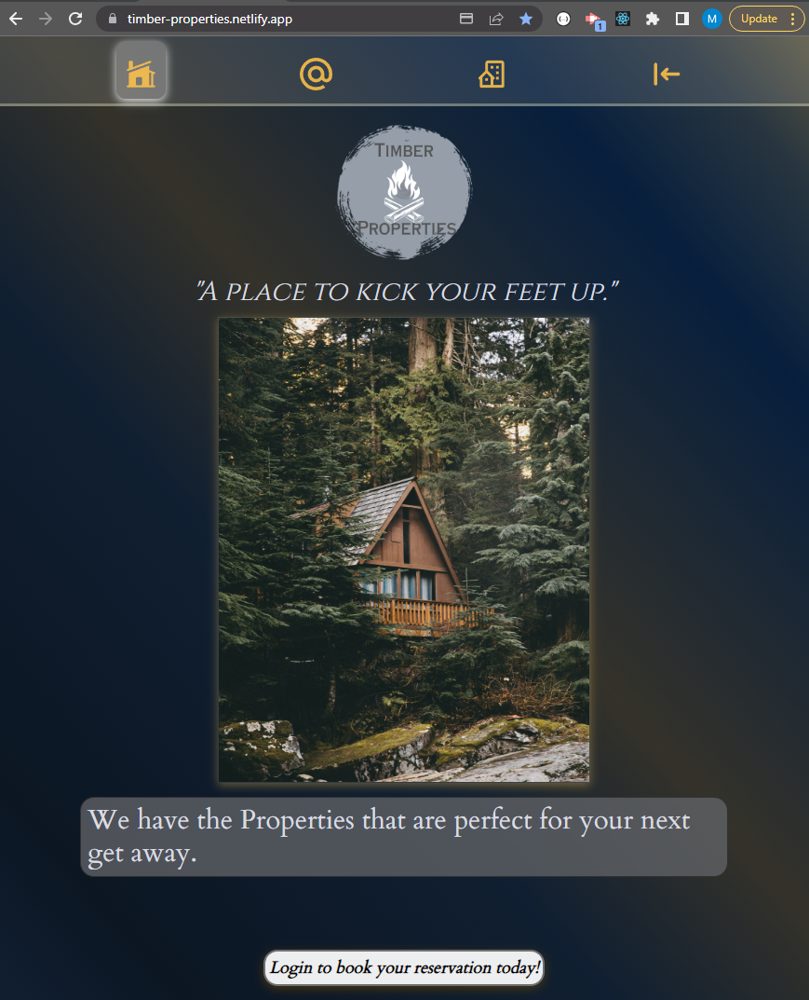

# Timber Properties 

## Description

This is a Full Stack (MERN) application I built where a rental property owner (and their staff) can host their various properties so that potential renters can review and reserve their properties.

You can checkout out the BackEnd (Server) Side Code [here](https://github.com/mjh1985codeman/timber-ridge).

## Tech Used

- React JS
    - What is this?
    - - A very popular Javascript framework developed by FaceBook it's a front end technology that is used to build scalable and fast web applictions.  You can check out the docs [here](https://react.dev/)

- Amazon Web Services (S3)
    - What is this?
    - - I used the S3 Bucket service from AWS to store and retrieve base64 encrypted json strings which houses the image data for the property pictures.  This was a great tool that I learned to utilize for the first time by searching through the docs which you can find [here](https://aws.amazon.com/s3/).  

- JSON WebToken.
   - What is this? 
   - - In authentication, when the user successfully logs in using their credentials, a JSON Web Token will be returned.  In its compact form, JSON Web Tokens consist of three parts separated by dots (.), which are: Header, Payload and Signature...This application uses JWT for Authorization purposes.  To learn more you can check out the docs [here](https://jwt.io/introduction).

- dotenv (to protect secret variables). 
    - What is this? 
    - - It's a npm that helps keep sensitive environment variables secure by allowing them to be stored in a .env file which can then be called upon throughout the application without actually being "part" of the code.  To learn more you can check out the docs [here](https://www.npmjs.com/package/dotenv).

- bcryptjs
    - What is this?
    - - An npm package that is used to encrypt passwords so that they are not visible outside the initial payload sent in by the client (IE: They are encypted in the database as well as the server responses).  Feel free to see the docs [here](https://www.npmjs.com/package/bcryptjs).

- mongoose
    - What is this? 
    - - An Object modeler for node.js to be used in conjunction with a MongoDB database (which is what this application utilizes).  In short; it just makes working with MongoDB easier. Again, feel free to check out their docs [here](https://mongoosejs.com/docs/guide.html).

- MongoDB (Specifically Atlas)
    - What is this?
    - - MongoDB Atlas is a great tool that essentially hosts our data in the cloud.  I've used it for many projects and I find it very easy to work with; check out the docs [here](https://www.mongodb.com/docs/atlas/getting-started/).

- Apollo Client and Apollo Server
    - What is this?
    - - Apollo Client and Apollo Server is a developer platform that is used in conjunction with a GraphQL API to build schema's which serves as a middleware between the server and the MongoDB.  It's a great tool that I've used on a few different projects.  You can checkout the docs [here](https://www.apollographql.com/docs/) and for the react Apollo Client information you can see that [here](https://www.apollographql.com/docs/react)

- Courier
    - What is this?
    - - Courier is a great service that I discovered when looking for way to implement email notifications.  You can checkout their docs [here](https://www.courier.com/docs/)

- Stripe
    - What is this?
    - - Stripe at its core is a Payment Processor.  In this application I setup a demo account and implemented a custom built payment flow that is utilized for customers to secure their reservation by paying a 'down payment' for the reservation.  One the payment is successfully processed the reservation is then created and stored in the DB.  Stripe is the Payment Technology that handles the payment processing in a secure way.  You can reveiw their docs [here](https://stripe.com/docs/payments)

## Deployed
Click [Here](https://timber-properties.netlify.app/) to see it. 

## ReadMe Icon Cred
Tech Icons Courtesy of <a target="_blank" href="https://icons8.com">Icons8</a>

